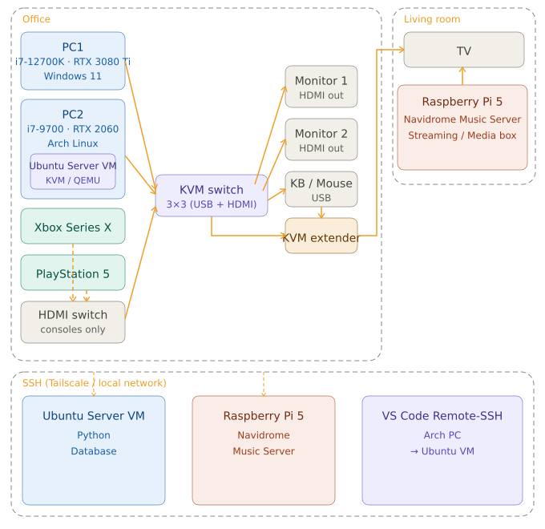

# Homelab

Personal homelab documentation - networking, self-hosting, virtulization, python server and database managment with locally hosted AI assistant.

## Hardware

| Device | Specs | Role |
|---|---|---|
| PC1 | i7-12700K, RTX 3080 Ti, 32GB RAM | Windows daily driver / gaming |
| PC2 | i7-9700, RTX 2060, 16GB RAM | Dev machine (Arch Linux) |
| Raspberry Pi 5 | 8GB RAM | Navidrome Music Server, Media Streaming Box |
| Xbox Series X | 4TB HDD | Gaming |
| PS5 | 4TB HDD| Gaming |

#### KVM Setup
- My KVM setup allows me to switch what controls my two monitors, keyboard, mouse, speakers, headphones, microphone, and any other peripherals. (Switch between PC1, PC2, PS5, Xbox). And the output of the kvm swith to monitor 1 is duplicated through a splitter and transmitted over ethernet (HDBaseT) to output on my TV. Resulting in me seamlessly switching from gaming on my monitor to my tv in another room. Or just sharing my main monitor to my tv.

## Audio

| Device | Role |
|---|---|
| CMA Questyle Twelve Master | Amp/DAC |
| Audeze LCD 2C Closed-Back | Audiophile headphones |
| Edifier MR5 Studio Monitors | 3-Way Speakers connected over XLR |

## What's Running

-**Ubuntu Server VM** Set up with QEMU, Libvirt, virt-manager, dnsmasq. Will contain python database.
- **Ollama + qwen2.5-coder:7b** — local LLM for coding assistance
- **Continue.dev** — VS Code extension connected to local LLM

- **Tailscale mesh network** (Pi + PC2 + iPhone)
- **Navidrome music server** on Pi

## In Progress

- Docker + Python dev stack on PC2

## Structure

- `networking/` — Tailscale, Pi network setup
- `dev-environment/` — PC2 Arch Linux dev setup
- `self-hosting/` — Raspberry Pi services
- `progress-log.md` — running log of work completed

## To Do:
- Take free bootcamps on **Git, SQL, Python, Azure.**
- Ask for **sample/test data.** Use AI (qwen) to generate and fill a fake version of the database for me to learn how to organize and query.

- **Set up Azure accounts.** Once python database is ready on ubserver, deploy to Azure.
- **Rice** (heavily customize) Arch install